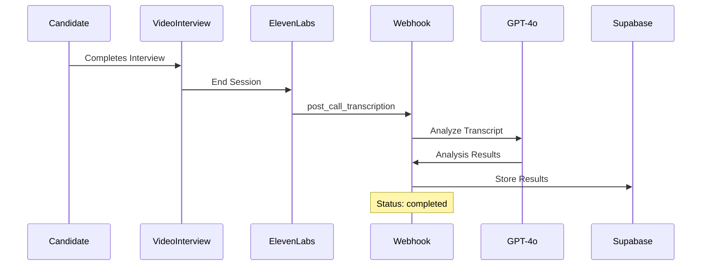

# ElevenLabs Webhook Setup for Automatic Interview Analysis

## 🎯 Overview

This guide helps you set up ElevenLabs webhooks to automatically analyze interview transcripts using GPT-4o after conversations end.

## 🔧 Setup Steps

### **1. Environment Variables**

Add these to your `.env` file:

```bash
# ElevenLabs Configuration
ELEVENLABS_API_KEY=your_api_key_here
ELEVENLABS_WEBHOOK_SECRET=generated_webhook_secret

# Azure OpenAI (for analysis)
AZURE_OPENAI_API_KEY=your_azure_key
AZURE_OPENAI_ENDPOINT=your_azure_endpoint

# Supabase (for data storage)
SUPABASE_URL=your_supabase_url
SUPABASE_ANON_KEY=your_supabase_key
```

### **2. ElevenLabs Dashboard Webhook Configuration**

1. **Go to**: [ElevenLabs Dashboard > Webhooks](https://elevenlabs.io/app/webhooks)

2. **Click**: "Create Webhook"

3. **Fill the form**:
   ```
   Webhook Name: Interview Analysis Webhook
   Callback URL: https://your-backend-domain.com/api/convai-webhook
   Webhook Auth Method: HMAC
   ```

4. **Example URLs**:
   - **Production**: `https://hire-ai-rg-backend-gafpbjhkdgemdsfp.southindia-01.azurewebsites.net/api/convai-webhook`
   - **Development**: `https://your-ngrok-url.ngrok.io/api/convai-webhook`

5. **Save**: Copy the generated `ELEVENLABS_WEBHOOK_SECRET`

### **3. Webhook Events**

Your webhook will receive these events:

#### **`post_call_transcription`** (Main Event)
```json
{
  "type": "post_call_transcription",
  "event_timestamp": 1739537297,
  "data": {
    "agent_id": "your-agent-id",
    "conversation_id": "conversation-123",
    "status": "done",
    "transcript": [
      {
        "role": "agent",
        "message": "Hello! Welcome to your video interview...",
        "time_in_call_secs": 0
      },
      {
        "role": "user", 
        "message": "Thank you, I'm excited to be here...",
        "time_in_call_secs": 2
      }
    ],
    "metadata": {
      "start_time_unix_secs": 1739537297,
      "call_duration_secs": 300,
      "cost": 150
    },
    "analysis": {
      "transcript_summary": "Professional interview conversation...",
      "call_successful": "success"
    }
  }
}
```

#### **`conversation_ended`** (Real-time Event)
```json
{
  "type": "conversation_ended",
  "data": {
    "conversation_id": "conversation-123",
    "agent_id": "your-agent-id"
  }
}
```

### **4. Webhook Security (HMAC Verification)**

Your webhook automatically verifies signatures using HMAC SHA256:

#### **Latest Format**:
```
ElevenLabs-Signature: t=1739537297,v0=signature_hash
```

#### **Legacy Format**:
```
ElevenLabs-Signature: sha256=signature_hash
```

## 🚀 Automatic Workflow

### **Complete Flow**:



### **Analysis Results**:

```json
{
  "domain_score": 85,
  "behavioral_score": 78,
  "communication_score": 82,
  "overall_score": 81,
  "confidence_level": "High",
  "cheating_detected": false,
  "body_language": "Confident and engaged",
  "speech_pattern": "Clear and articulate",
  "areas_of_improvement": [
    "Strengthen knowledge in system design",
    "Practice explaining complex concepts simply"
  ],
  "system_recommendation": "Recommended for Panel Interview"
}
```

## 🧪 Testing

### **1. Test Webhook Endpoint**

```bash
curl -X POST https://your-backend-domain.com/api/convai-webhook \
  -H "Content-Type: application/json" \
  -H "ElevenLabs-Signature: v0=test_signature" \
  -d '{"type": "test", "data": {}}'
```

### **2. Test Analysis Endpoint**

```bash
curl -X POST https://your-backend-domain.com/api/test-interview-analysis \
  -H "Content-Type: application/json" \
  -d '{
    "conversation_id": "test-conversation-id",
    "candidate_name": "Test Candidate",
    "job_role": "Software Engineer"
  }'
```

### **3. Local Development with ngrok**

```bash
# Install ngrok
npm install -g ngrok

# Expose local server
ngrok http 8000

# Use the generated URL for webhook setup
https://abc123.ngrok.io/api/convai-webhook
```

## 🔍 Monitoring & Debugging

### **Webhook Logs**

Your webhook handler provides detailed logging:

```python
logger.info("🎯 Processing post-call transcription for conversation: {conversation_id}")
logger.info("📊 Call status: {status}, Agent: {agent_id}")
logger.info("✅ Interview results stored successfully for session {session_id}")
logger.info("📊 Analysis summary - Overall: {overall_score}%")
```

### **Log Levels**:
- ✅ Success operations
- ⚠️ Warnings (non-critical issues)
- ❌ Errors (critical failures)
- 🎯 Processing steps
- 📊 Data summaries

### **Common Issues**:

1. **Signature Verification Failed**
   - Check `ELEVENLABS_WEBHOOK_SECRET` is correct
   - Verify timestamp tolerance (30 minutes)

2. **Session Not Found**
   - Ensure `conversation_id` is stored in `interview_sessions` table
   - Check that session was created before interview

3. **Transcript Empty**
   - Check ElevenLabs API key permissions
   - Verify conversation was recorded properly

## 📊 Frontend Integration

Results automatically appear in your dashboard:

- **Job-based organization**: Results grouped by job posting
- **Real-time updates**: Status changes from "active" → "completed"
- **Detailed analysis**: Comprehensive candidate evaluation
- **Action items**: Specific improvement recommendations

## 🔄 Manual Triggers

If webhook fails, you can manually trigger analysis:

```bash
# Via API endpoint
curl -X POST https://your-backend-domain.com/api/interviews/{session_id}/complete \
  -H "Content-Type: application/json" \
  -d '{"conversation_id": "conversation-123"}'

# Via Frontend
Navigate to VideoInterview → Click "End Interview"
```

## 🛡️ Production Considerations

### **Security**:
- ✅ HMAC signature verification
- ✅ Timestamp validation (30-minute tolerance)
- ✅ Environment variable protection
- ✅ Database connection pooling

### **Reliability**:
- ✅ Automatic retries for failed analysis
- ✅ Fallback to API transcript fetch
- ✅ Comprehensive error logging
- ✅ Graceful failure handling

### **Performance**:
- ✅ Async processing
- ✅ Rate limiting compliance
- ✅ Efficient database queries
- ✅ Minimal memory footprint

---

Your ElevenLabs webhook integration is now ready for production! 🚀 